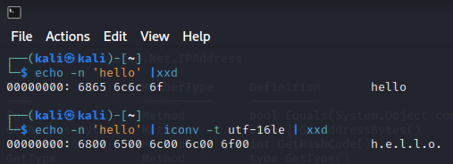

LM (Lan Manager)
----------------
The LM hash is Microsoft's oldest form of password storage dating back to the 1980's. LM is turned off by default since Vista/Server 2008 but can be enabled on more recent systems via a GPO.

The LM hash is generated via the following algorithm.

1. Convert lowercase to uppercase
2. Pad with NULL up to 14 characters 
3. Split into two 7-byte blocks
4. Convert each block to a DES key 
5. DES encrypt the string "KGS!@#$%" with these two keys
6. Concatenate the strings to return a 16-byte hash

NTLM (New Technology Lan Manager)
----
This algorithm is much simpler
`NT hash = md4(utf16-le(password))`
utf16-le is a type of character encoding. Where ascii characters are 8 bits long or 1 byte, utf-16le represents one ascii character as 2 bytes as the bloew image displays



NetNTLMv1
---------
NetNTLMv1 and v2 are authentication protocols and not a form of password storage. The NetNTLMv1 algorithm can use either the LM hash or the NT hash, as such responses are calculated using both hashes and sent to the server.

1. The server sends a random 8-byte challenge
2. Hash the challenge. Both the LM and NT hash produce 16 byte outputs
3. Pad this with 5 bytes of zeros up to 21 bytes
4. Produce three 7 byte keys
5. DES encrypt the 8 byte challenge with each key
6. The response is these three encrypted strings concatenated

In short hand this is

```
C = 8-byte server challenge, random
K1 | K2 | K3 = NTLM-Hash | 5-bytes-0
response = DES(K1,C) | DES(K2,C) | DES(K3,C)
```
          
NTLMv2
------
